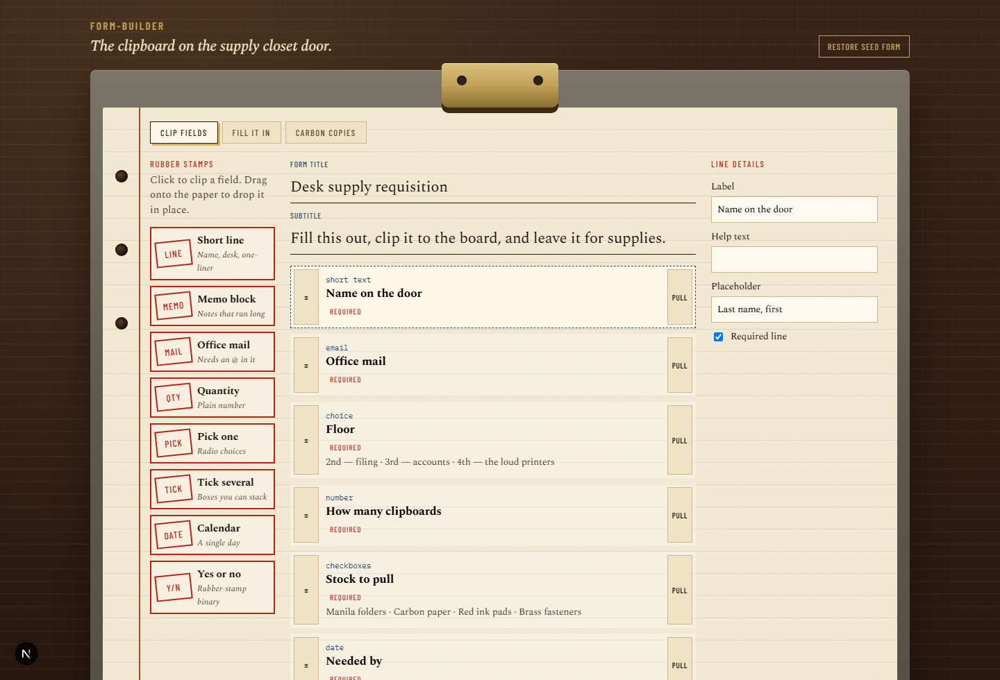

# form-builder

A desk-closet clipboard for assembling a form, filling it, and exporting the carbon copies as CSV. Everything lives in the browser (`localStorage`). No account, no backend.

## Run it

```bash
npm install
npm run dev
```

Open [http://localhost:3000](http://localhost:3000). You should see a walnut desk, a brass clip, and a seeded **Desk supply requisition**. Stamp fields on the left rail, fill the middle sheet, then export copies.

## How the sheets work

1. **Clip fields** — click a rubber stamp or drag it onto the paper. Reorder with the handle. **Pull** removes a line.
2. **Fill it in** — preview as a real form. Required lines stamp **VOID** if you skip them.
3. **Carbon copies** — mock replies (two come with the seed). **Export CSV** downloads a spreadsheet of the pile.

**Restore seed form** wipes your edits and puts the sample requisition back.

## Layout

- `src/domain` — field kinds, validation, CSV
- `src/data` — seed requisition and `localStorage`
- `src/ui` — clipboard chrome, builder, fill, copies


