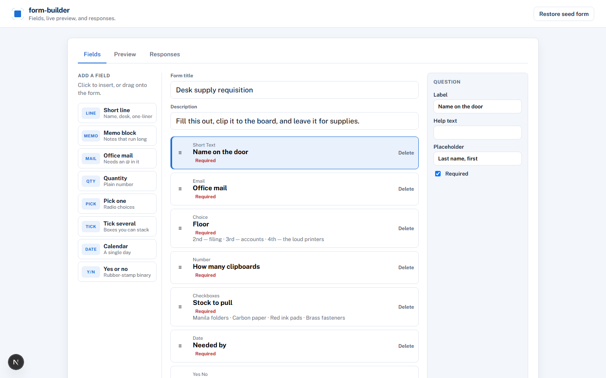

# form-builder

Build a form, preview it, and review responses in a table. Everything lives in the browser (`localStorage`). No account, no backend.

## Run it

```bash
npm install
npm run dev
```

Open [http://localhost:3000](http://localhost:3000). You should see a field list, a live preview, and a responses table, with a seeded **Desk supply requisition**.

Look: Tally / Google Forms layout — field list, live preview, responses table — white canvas with a blue accent (Public Sans). Not NCR carbon copies.

## How it works

1. **Fields** — click a field type or drag it onto the form. Reorder with the handle. Delete removes a question.
2. **Preview** — fill the form as a respondent. Required questions must be answered before submit.
3. **Responses** — mock replies (two come with the seed). **Export CSV** downloads a spreadsheet.

**Restore seed form** wipes your edits and puts the sample requisition back.

## Layout

- `src/domain` — field kinds, validation, CSV
- `src/data` — seed requisition and `localStorage`
- `src/ui` — product shell, builder, preview, responses


