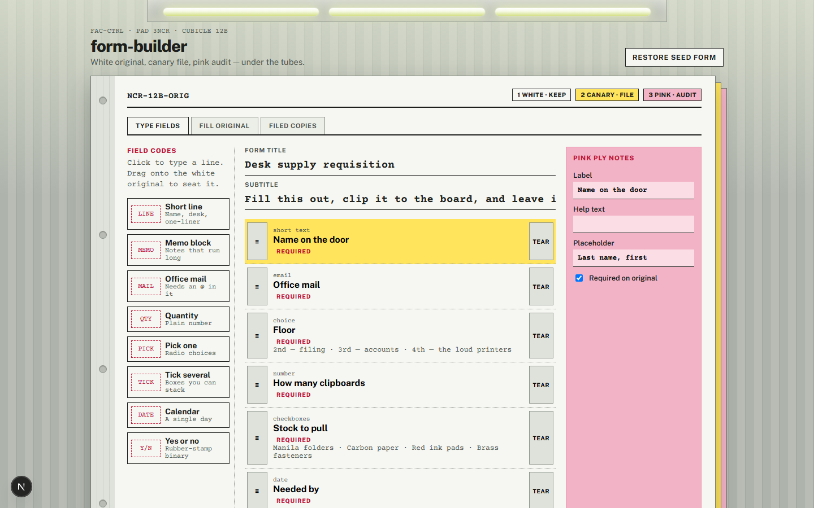

# form-builder

A 3-ply NCR pad for assembling a form, filling the white original, and exporting canary copies as CSV. Everything lives in the browser (`localStorage`). No account, no backend.

## Run it

```bash
npm install
npm run dev
```

Open [http://localhost:3000](http://localhost:3000). You should see fluorescent cubicle tubes, a white / canary / pink stack, and a seeded **Desk supply requisition**. Field codes sit on the left rail; type them onto the original, fill it, then export filed copies.

Look: NCR carbon copies under gray cubicle fluorescents (Public Sans + Courier Prime) — not an oak clipboard.

## How the sheets work

1. **Type fields** — click a field code or drag it onto the white original. Reorder with the handle. **Tear** removes a line.
2. **Fill original** — preview as a real form. Required lines stamp **VOID** if you skip them.
3. **Filed copies** — mock replies (two come with the seed). **Export CSV** downloads a spreadsheet of the pad.

**Restore seed form** wipes your edits and puts the sample requisition back.

## Layout

- `src/domain` — field kinds, validation, CSV
- `src/data` — seed requisition and `localStorage`
- `src/ui` — NCR chrome, builder, fill, copies


